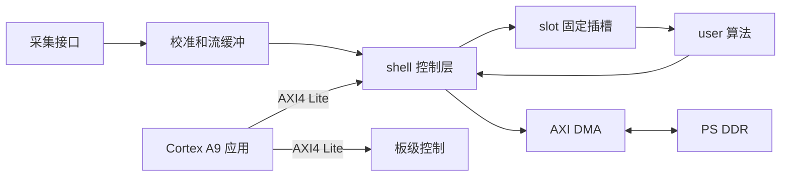

# 基于 ZYNQ7020 的信号处理系统

[](https://www.amd.com/en/products/adaptive-socs-and-fpgas/soc/zynq-7000.html)
[](https://www.amd.com/en/products/software/adaptive-socs-and-fpgas/vivado.html)
[](https://www.amd.com/en/products/software/adaptive-socs-and-fpgas/vitis.html)
[](LICENSE)

[English](README_EN.md) | 简体中文

本工程面向 ZYNQ7020 CLG400-1，包含板级采集与回放、PL 流处理、AXI DMA 和 PS 裸机应用。Vivado Block Design 及板级链路已在目标硬件上完成验证。

## 系统结构



数据面使用 32 位 AXI4 Stream，控制面使用 AXI4 Lite。固定插槽负责隔离 Block Design 与算法实现，PS 侧通过统一接口配置和启停算法。

## 仓库结构

| 路径 | 内容 |
| --- | --- |
| `ACM2108use.xpr` | Vivado 2025.1 工程入口 |
| `ACM2108use.srcs/sources_1/bd/system/system.bd` | 主 Block Design |
| `ACM2108use.srcs/sources_1/modules/slot.v` | 固定算法插槽，通常无需修改 |
| `ACM2108use.srcs/sources_1/modules/user.v` | 用户算法入口 |
| `vitisV2/SignalAPP_V1_2/src` | 最新验证的周期信号测量 APP |
| `vitisV2/SignalAPP_V1_2/tests` | Signal APP 主机回归测试 |
| `vitisV2/SignalAPP_V1_2/src/hal/slot.h` | PS 侧统一接口 |
| `tools/build_signalapp_v1_2.py` | 从 XSA 重建 platform 和 APP |
| `build.tcl` | 硬件一键构建与 XSA 更新 |
| `structure.xsa` | 包含 bitstream 的硬件平台文件 |

工程内部目录名 `ACM2108use` 来自板级验证阶段。为保持 Vivado 路径引用和 IP 配置稳定，该名称仅作为工程内部标识保留，与 GitHub 仓库名称无关。

## 接入新模块

1. 保留 `user.v` 的模块名和端口。
2. 将算法逻辑写入 `user`，也可在其中例化其他 RTL 文件。
3. 正确处理 `tvalid`、`tready` 和 `tlast`，数据宽度保持 32 位。
4. 使用 `cfg0` 到 `cfg7` 接收 PS 参数，通过 `status` 返回一个 32 位状态字。
5. 重新综合并生成 `structure.xsa`。

默认 `user.v` 为无损直通实现，因此尚未加入算法时主链路仍可运行。新算法无需修改 `system.bd`、DMA、时钟、复位和地址映射。

在工程根目录执行以下命令即可完成 Block Design 校验、综合、实现、bitstream 和 XSA 更新：

```powershell
vivado -mode batch -source build.tcl
```

该脚本同时处理 Vivado 2025.1 的 AXI 时钟元数据和首次构建运行脚本问题。

## Signal APP

`SignalAPP_V1_2` 是当前正式应用，包含 35 MSPS ADC0 采集、511 抽头低通滤波、7 倍抽取、16384 点 FFT、5 kHz 至 800 kHz 周期信号分析、最多 3 个谐波分量检测、峰峰值、真有效值、THD、波形显示和频谱显示。

使用 Vitis Command Line Tool 2025.2 执行：

```powershell
vitis -s tools/build_signalapp_v1_2.py
```

脚本使用根目录 `structure.xsa` 创建 `Signal_V1_2` standalone platform，构建 BSP 和 FSBL，再创建并构建 `SignalAPP_V1_2`。全部生成内容位于被 Git 忽略的 `build/vitis`。

## PS 侧接口

`slot.h` 提供简洁 API：

```c
slot_t alg;

slot_init(&alg, SLOT_BASE);
slot_set(&alg, 0, 1000U);
slot_reset(&alg);
slot_run(&alg);

u32 state = slot_status(&alg);
```

| 函数 | 用途 |
| --- | --- |
| `slot_run` | 启用用户算法 |
| `slot_bypass` | 绕过用户算法并保持主链路 |
| `slot_reset` | 对用户算法执行软复位 |
| `slot_set` 和 `slot_get` | 访问 8 个配置寄存器 |
| `slot_status` | 读取用户算法状态 |
| `slot_samples` 和 `slot_frames` | 读取传输统计 |

插槽基地址为 `0x40030000`。上电后默认启用旁路，调用 `slot_run` 后数据进入 `user`。

## 工具版本

1. Vivado 2025.1 用于 Block Design、综合、实现、bitstream 和 XSA。
2. Vitis Command Line Tool 2025.2 用于 platform、BSP、FSBL 和 application。
3. 目标器件为 `xc7z020clg400-1`。

## 打开工程

```powershell
vivado ACM2108use.xpr
```

根目录中的 `structure.xsa` 用于创建 standalone platform。正式 APP 源码位于 `vitisV2/SignalAPP_V1_2/src`。

## 当前验证结果

| 检查项 | 结果 |
| --- | --- |
| AXI4 Stream 直通、背压和 `tlast` 仿真 | 通过 |
| Vivado 2025.1 综合、实现、DRC 和 bitstream | 通过，0 error，0 critical warning |
| 实现后时序 | WNS 0.525 ns，TNS 0 ns |
| `structure.xsa` | 已更新，包含 bitstream 和 `alg_slot` |
| Vitis 2025.2 `Signal_V1_2` platform、BSP 和 FSBL | 从当前 XSA 构建通过 |
| Vitis 2025.2 `SignalAPP_V1_2` | 构建通过，生成 `SignalAPP_V1_2.elf` |
| Signal APP 主机回归测试 | 6 项全部通过 |

## 发布边界

仓库仅保留 Vivado 工程源文件、Signal APP 源码与测试、可复现构建脚本、`structure.xsa` 和说明文件。缓存、runs、gen、BSP、FSBL、export、ELF、仿真输出、日志、HMI 素材与本地编辑器配置不进入仓库。

## 许可

本项目采用 [MIT License](LICENSE)。AMD 生成源文件及第三方组件继续遵循各自文件中的许可声明。
